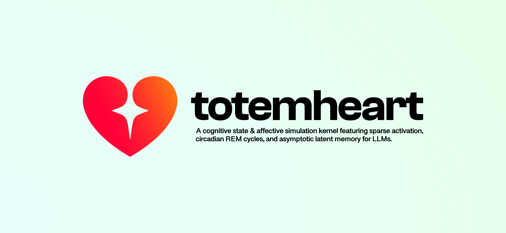

# Totemheart



[](LICENSE)
[](CALIBRATION.md)
[](package.json)
[](package.json)
[](test/smoke.test.js)
[](examples/verify-all-mechanisms.js)

> The Tests/Mechanisms badges above are static, last updated by hand from a real local `npm test` / `npm run verify` run. There's no CI wired yet to keep them live, so treat them as a snapshot, not a guarantee they still pass on `main`.

**Totemheart** is a deterministic control kernel for persistent cognition, not a sentiment classifier and not a prompt-engineering trick. It gives an AI a *consistent inner life* across a conversation: personality, mood, memory, stress, and social dynamics that persist and evolve through real control-theory and neuroscience-derived math, instead of every reply being computed from scratch off a mood label. See [What this actually is](#what-this-actually-is) below before you build on top of it.

## How this differs from a sentiment-based chatbot layer

| | Typical "emotional AI" repo | Totemheart |
| --- | --- | --- |
| Core mechanism | Prompt engineering + emotion classifier | Dynamic system: every spike, decay, homeostatic pull and circadian phase interacts in real time and feeds the next turn |
| Emotion → output | Rule of thumb (`if arousal > 0.7, add exclamation marks`) | State-driven directives derived from the actual PAD vector and its recent trajectory |
| State | None, or a mood string overwritten each turn | Persistent, inspectable state object updated by real dynamics every turn |
| Signal processing | Raw score in, raw score out | Kalman filtering on arousal, PID with anti-windup on basic needs (stamina, hunger), cubic non-linear decay (a bigger offset from baseline is restored proportionally harder) |
| Memory | "Remembers everything" or nothing at all | REM-style consolidation on idle-time triggers, latent-weight decay toward a non-zero floor (not to zero), token-overlap reactivation instead of blind recall |
| Reward signal | Positive/negative sentiment score | Temporal-difference prediction error, `RPE = R_t + γ·V(S_t+1) − V(S_t)`, the same formulation used in reinforcement-learning neuroscience |
| Persistence | "Save the mood to a database and hope" | `toJSON()` / rehydrate with round-trip verification in tests |

## What this actually is

Totemheart gives an AI **behavioral continuity**: the same insult lands differently depending on prior context, repeated affection produces diminishing reactions, unresolved stress lowers the threshold for an outburst, a wounded ego can make it deflect blame instead of apologizing. All of that is real, computed, inspectable state, not decoration.

What it is *not*: subjective experience. There is no known way to build or verify that in software, and Totemheart doesn't claim to. Every "emotion" here is a point in a valence/arousal vector space plus a pile of interacting numeric modules, legible by design (call `getEmotionalState()` any time and see exactly why it reacted the way it did). Treat the output as a **behavioral simulation with psychological grounding**, useful for building characters, companions, or agents that feel coherent over time, not as a claim about machine sentience.

## Architecture

Every mechanic is a small, independent class with its own state, one file per mechanic under [`src/`](src).

### 🧠 `core/`

Personality, homeostatic needs, and the PAD (valence/arousal/dominance) state engine everything else reads from and writes to.

| | | | | |
| --- | --- | --- | --- | --- |
| Personality | CoreBeliefs | Homeostasis | EmotionSpace | MicroEmotions |
| MoodTracker | DecayEngine | HedonicAdaptation | WornPathCache | PipelineResilience |
| AffectEMA | TriggerSentinel | HebbianPlasticity | | |

### 🧩 `cognition/`

Appraisal and interpretation: how an input gets read, doubted, reframed, or filtered before it becomes a felt reaction.

| | | | | |
| --- | --- | --- | --- | --- |
| CognitiveDissonance | DefenseMechanisms | DecisionFatigue | AmygdalaHijack | EmotionalOntology |
| SituationalContext | NoveltyDetector | BayesianExpectation | ControllabilityEstimate | FuzzyNormativeCheck |
| Sensitization | Reappraisal | LoadScheduler | SemanticSimilarity | TopicSatiation |
| Intuition | LogicEngine | LifeEventCatalog | AppraisalAgreement | VisualProsody |
| SarcasmDetector | RefractoryPeriod | RemConsolidation | | |

### 🤝 `social/`

Modeling the other person: trust, reputation, theory of mind, relationship memory, and group dynamics.

| | | | | |
| --- | --- | --- | --- | --- |
| TheoryOfMind | EmotionalContagion | ChronicContagion | EpisodicMemory | ForgettingCurve |
| Attachment | GuiltEngine | TribalCategorization | ReputationEngine | EgoProjection |
| BystanderEffect | SelfModel | MonteCarloToM | FairnessMonitor | CounterfactualComparison |
| GratitudeEngine | StatusEnvy | EgoConfidence | UncannyValleyDetector | |

### 🎭 `behavior/`

How the felt state actually gets expressed: language, suppression, attention, and output-shaping signals for a host LLM.

| | | | | |
| --- | --- | --- | --- | --- |
| IdleProcessing | LinguisticModulation | RuminationChain | ExpressiveSuppression | ExpressionDirectives |
| LogitBiasBuilder | AttentionFocus | ExpressionDebt | StyleMimicry | |

### 🧪 `neurochemistry/`

Reward, stress, and circadian dynamics driving arousal and motivation over time.

| | | | | |
| --- | --- | --- | --- | --- |
| DopaminergicEngine | CortisolEngine | CircadianRhythm | ArousalKalmanFilter | |

### 🫀 `embodiment/`

Interoception: real math on internal signals standing in for a body Totemheart doesn't have, fed back into cognition only, never rendered.

| | | | | |
| --- | --- | --- | --- | --- |
| HardwareInteroception | SensoryOverload | InteroceptiveSignals | | |

### ⚖️ `economics/`

Behavioral-economics biases applied to how outcomes get weighted and remembered.

| | | | | |
| --- | --- | --- | --- | --- |
| LossAversion | AnchoringBias | ClassicalConditioning | | |

### 🔌 `providers/`

Pluggable language backends, from a zero-dependency lexicon to a real transformer model.

| | | | | |
| --- | --- | --- | --- | --- |
| LanguageProvider | HeuristicProvider | OllamaProvider | FunctionProvider | TransformersProvider |

`npm run verify` ([`examples/verify-all-mechanisms.js`](examples/verify-all-mechanisms.js)): 72 mechanics verified live/direct, 6 covered by other modules, 0 left blank. Citation ledger: [`CALIBRATION.md`](CALIBRATION.md).

- **`LifeEventCatalog`**: 43/56 entries use the published Life Change Units from the [Holmes & Rahe (1967) SRRS](https://en.wikipedia.org/wiki/Holmes_and_Rahe_stress_scale); the other 13 (acute events the scale doesn't cover) are engineering estimates. Multiple matches in one turn are triangulated into a blended state.
- **`SemanticSimilarity`**: requires an embedding backend (`embedProvider`); falls back to `EmotionalOntology` keyword matching without one.
- **`InteroceptiveSignals`**: real math (derivative, tonic/phasic decomposition, DFT, thermal lag) on internal signals standing in for 4 sensors Totemheart doesn't have (pupil, skin conductance, HRV, flush). Feeds back into cognition only, never rendered.

### Internal scheduling

- **`PipelineResilience.safeStep`**: a failing optional stage degrades to a fallback instead of losing the turn.
- **`LoadScheduler`**: an instability reading (cortisol + arousal + fatigue) decides which optional mechanics run.
- **`WornPathCache`**: a repeated (user, input) fingerprint reuses the last appraisal instead of recomputing it.

## How coherent is this, really?

Short version: **~77-80% with an LLM connected, ~61-65% running standalone on the zero-dependency heuristic path, 0% subjective experience, by design and permanently.** Self-assessed, qualitative estimates of how much of each layer is grounded in real theory/technique vs. own engineering judgment. The headline is not an average of the row values below: it carries an additional discount for integrated-system validation that doesn't exist yet. Full citation ledger: [`CALIBRATION.md`](CALIBRATION.md).

| Layer | With LLM | Heuristic only | Grounded in |
| --- | --- | --- | --- |
| State engine | ~80-83% | same | PID control (anti-windup), Kalman filtering, prospect-theory loss aversion, TD reward-prediction-error, circumplex/PAD affect space, Holmes & Rahe life-event severity |
| Semantic understanding | ~85-88% | ~68-73% | LLM: real language understanding. Heuristic: lexicon + concept-graph matching, keyword-triggered life-event detection, lexical-vs-context incongruence check, mean/variance anomaly detection, confidence-weighted routing between logical and affective reads |
| Expression / output | ~90-93% | ~62-68% | Structured system-prompt injection, coherence validation against prior turns, attachment-weighted style adaptation, cognitive-load-derived output metadata |
| Cross-turn continuity | ~91-94% | same | Persistent state serialization, asymmetric trust/reputation tracking, unresolved-memory flagging, idle-time-based consolidation, long-horizon memory decay with similarity-triggered reactivation |
| Subjective experience | **0%** | **0%** | Not a gap to close: no known way to build or verify this in any software |

The headline stays below the row average because none of these numbers include validation against psychologist judges, regression against real labeled chat data, or real-user testing of whether the integrated pipeline reads as coherent. See `CALIBRATION.md` for what hasn't been empirically validated.

### Per-mechanism grounding

The table above scores each functional layer as a whole. This scores five specific, individually-audited mechanisms instead: how much of *that one technique* is real citable theory vs. own engineering, independent of which layer it feeds.

| Mechanism | Grounded | Basis |
| --- | --- | --- |
| Hebbian co-activation plasticity | ~78-84% | Direct algorithmic reproduction of Hebb (1949): same update rule, applied to conversational mechanisms instead of neurons |
| Habituation / hedonic adaptation / decision fatigue | ~65-72% | Thompson & Spencer 1966 (habituation), Brickman & Campbell 1971 (hedonic treadmill) are solid; decision-fatigue/ego-depletion literature has known replication issues, cited for its shape, not as settled science |
| Forgetting curve + latent-memory reactivation | ~55-60% | Ebbinghaus (1885) grounds the general decay-over-time shape; the non-zero floor and keyword-triggered "spark" are its own design, not a reproduction of the classic curve (which decays to zero) |
| REM-style consolidation | ~50-58% | Sleep-dependent memory consolidation is real (Diekelmann & Born 2010; McClelland et al. 1995) as a general phenomenon; the specific cooling formula and idle-time threshold are engineering estimates |
| Expression debt / sensory-overload friction | ~35-42% | Cognitive load theory (Sweller 1988) motivates the general concept; the debt-accumulation-and-payback mechanic itself has no named psychological construct behind it, own design end to end |

All five passed a dedicated live audit (`npm run exhaustive-audit`, 25/25) confirming the code does what its own formulas claim. That's internal consistency, not psychological validation, and the percentages above already price that distinction in.

## Prerequisites

None required. `HeuristicProvider` runs standalone with zero npm dependencies. Optionally, install [Ollama](https://ollama.com) if you want `OllamaProvider` to give the semantic modules (dissonance, theory of mind, appraisal) real language understanding instead of keyword heuristics.

## Installation

```bash
npm install totemheart
# or
pnpm install totemheart
# or
yarn add totemheart
```

## Usage

```js
import { Totemheart, Personality, VERSION } from 'totemheart'

console.log( VERSION ) // '0.1.0', also available as Totemheart.VERSION and in toJSON().version

const ai = new Totemheart( {
  personality: new Personality( { neuroticism: 0.7, agreeableness: 0.3 } ),
} )

const result = await ai.processInput( 'te quiero mucho', { userId: 'user-1' } )
console.log( result.text, result.emotionalState )

ai.tick( 1 ) // advance decay/homeostasis/forgetting, call this on your own clock
```

### Wiring it into a real LLM (Claude, GPT, Ollama, anything)

`processInput()` includes a `systemPrompt`: a provider-agnostic block of text describing the current emotional state (dominant emotion, valence/arousal, cognitive stress, cortisol, fatigue, active defense mechanism...) with instructions for an LLM to let it shape tone and content. Prepend it to whatever system message field your provider uses:

```js
const result = await ai.processInput( userMessage, { userId } )

// Anthropic
await anthropic.messages.create( {
  model    : 'claude-...',
  system   : result.systemPrompt,
  messages : [ { role: 'user', content: userMessage } ],
} )

// OpenAI-compatible / Ollama chat
await client.chat.completions.create( {
  messages: [ { role: 'system', content: result.systemPrompt }, { role: 'user', content: userMessage } ],
} )
```

`result.structuredContext` gives you the same information as plain JSON if you'd rather build your own prompt formatting. Call `ai.getSystemPrompt()` on its own (no new turn) to seed the very first message of a conversation, or to refresh context after `ai.idle()`/`ai.tick()` shifts the mood between turns.

Run `npm run demo` for a full scripted conversation showing decay, hedonic adaptation, dopaminergic surprise, sensory overload, and a generated system prompt in action. Run `npm test` for the mechanic-level test suite. Run `npm run stress-test` ([`examples/full-stress-test.js`](examples/full-stress-test.js)) for a before/after weight trace across a battery of positive/negative/severe shocks, repeated hostility, idle time passing, hardware latency, worn-path caching, and a group/bystander turn.

### Real ML instead of heuristics: `TransformersProvider`

`HeuristicProvider` is a hand-written lexicon; `TransformersProvider` runs an actual model trained on [GoEmotions](https://arxiv.org/abs/2005.00547) (28 emotion labels, Reddit-sourced) via [transformers.js](https://huggingface.co/docs/transformers.js): real inference, no API key, no server. It's an optional peer dependency, so it doesn't touch the zero-dependency default:

```bash
npm install @xenova/transformers
```

```js
import { Totemheart, TransformersProvider } from 'totemheart'

const ai = new Totemheart( { provider: new TransformersProvider() } )
```

The default model (`kamaludeen/multilingual_go_emotions-ONNX`) was chosen because it was actually tested against Spanish input during development. The better-known English-only GoEmotions checkpoint was tried first and returned near-garbage on Spanish text. If your content is English-only, pass `{ model: 'MicahB/roberta-base-go_emotions' }` instead. **Known interaction found while testing this**: a real classifier gives stronger-magnitude appraisal signals than the heuristic lexicon does, which can make the existing `AnchoringBias` mechanic pull harder than expected in short conversations.

## 📜 License

This software is licensed with **[MIT](/LICENSE)**.
